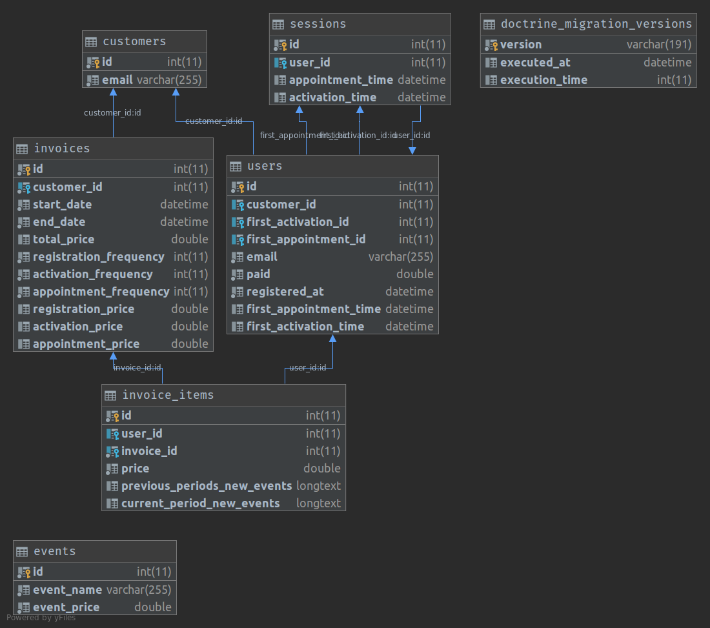
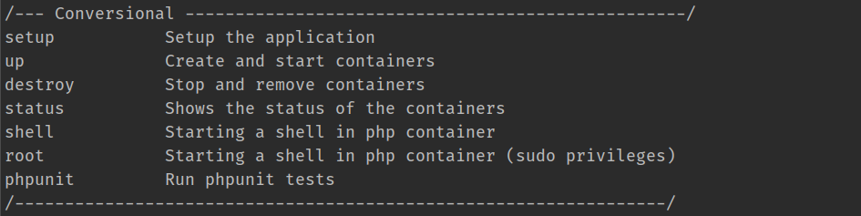

# Conversional Challenge (Invoice Service)

My demo for interview with Conversional. This app contains a dockerized web app which designed to easily install and configured on any machine.

## Installation Requirements
* Shell Access
* Docker
* Docker Compose
* Git
* Make
* CURL

## Docker Services
* NGINX Reverse Proxy
* PHP FPM
* MySQL Database

## Installation Guide:
```
cd ~
git clone git@github.com:zeina1i/conversional-challenge.git
cd conversional-challenge
cp .env.example .env
cp .env.test.example .env.test
make setup
```
Now app should be alive on [http://localhost:8090](http://localhost:8090)
<p align="center"></p>

## DataModel
<p align="center"></p>

## How To Use App:
Issue these sets of command inside your terminal:
### Create Invoice
```
curl --location --request POST 'localhost:8090/customer/1/invoice' \
--header 'Content-Type: application/json' \
--data-raw '{
    "start_date" : "2021-01-01",
    "end_date": "2021-02-01"
}'
```

### Get Invoice
```
curl --location --request GET 'localhost:8090/customer/1/invoice/1'
```

## Commands
In order to run commands easily you can use make command. This will help you to easily interact with containers or app.
<p align="center"></p>

## Run Tests
```
make phpunit
```

## Caution
* This data-model is suitable if we don't want to add more events to the system in the future,
<br />
Otherwise we have session_events table which has n to 1 relation with session table.
This is one example of the sessions and session_events mode:
<br />

```
sessions
id, user_id
1 , 4
-------------------
session_events
session_id, event_id, time
1         , 2       ,2020-10-10
1         , 5       ,2021-10-10
```

* As we are calculating and storing the invoice and invoice items data in http request, this code is suitable for invoice that don't store thousands of records.
<br />
For systems with big number of users we should have a broker and handle storing data in the workers.